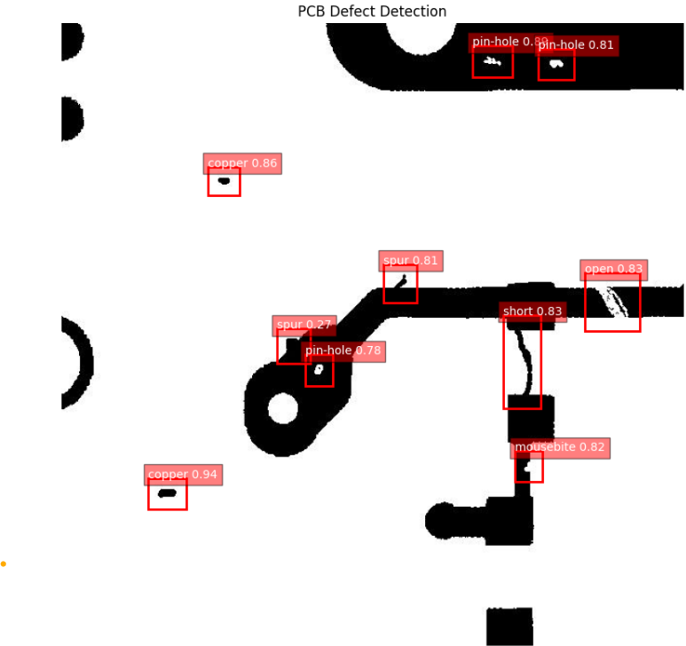

# PCB Defect Detection using YOLOv8

## Overview
This project focuses on **automatic defect detection in Printed Circuit Boards (PCBs)** using **YOLOv8**, a state-of-the-art object detection model. By leveraging the **DeepPCB dataset**, the model is trained to identify and classify various types of PCB defects with high accuracy.

## Objective
The primary goal of this project is to develop a **computer vision model** capable of detecting and classifying PCB defects into six categories:

- **Open**
- **Short**
- **Mousebite**
- **Spur**
- **Copper**
- **Pin-hole**

This solution can be applied to **automated quality control systems** in PCB manufacturing, reducing manual inspection efforts and improving efficiency.

## Project Structure
```
├── preprocessed_data/    # Processed dataset ready for training
│   ├── images/           # Training and validation images
│   ├── labels/           # Corresponding YOLO format labels
│   ├── trainval.txt      # List of training images and annotations
│   ├── test.txt          # List of test images and annotations
│
├── examples/             # Sample images before and after detection
│   ├── original.jpg      # Original PCB image
│   ├── detected.jpg      # Image with detected defects
│
├── model/                # Trained YOLOv8 model files
│
├── PCB_Defect_Detection.ipynb  # Jupyter Notebook for training & inference
```

## Example Output
Below is an example of the defect detection results:

| Original Image | Detected Defects |
|---------------|-----------------|
|  |  |

The detected defects are highlighted with bounding boxes and classified into one of the six defect categories.

---
This project serves as an efficient **deep learning-based quality control solution** for PCB defect detection, offering potential applications in real-world manufacturing and automated inspection systems.

